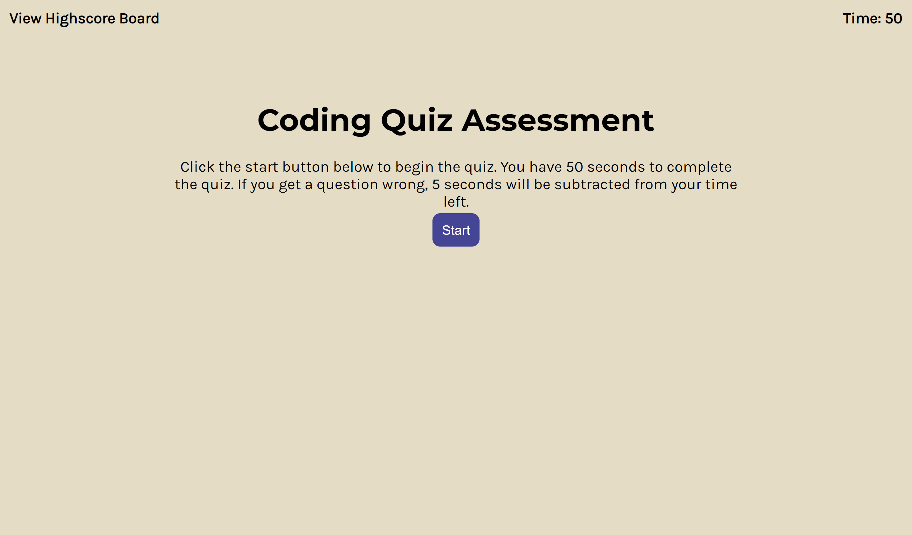

# timed-coding-assessment

## Description

This is a quiz game to test your coding knowledge in CSS, JavaScript, and HTML. You gain 5 points for every correct question but lose 5 seconds on the timer for every incorrect question. You can see a log of your high scores as well. 

## Installation

N/A

## Usage

The web application can be viewed [here](https://savannah-shifflet.github.io/timed-coding-assessment/). Below is a screenshot of the page. 

## Credits

The normalize.css file used is attributed to GitHub user Necolas and can be found [here](https://necolas.github.io/normalize.css/).

## License

Please refer to the LICENSE in the repo.
